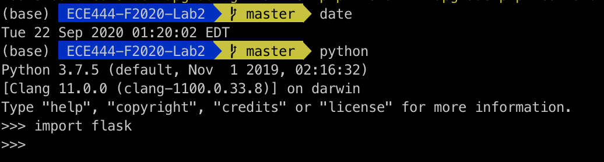
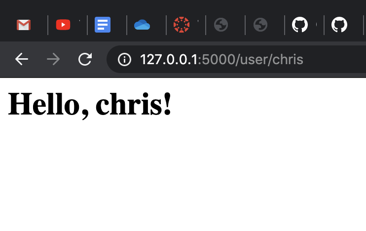

# ECE444-F2020-Lab2

Chris Dryden

This repo is a clone of https://github.com/miguelgrinberg/flasky

Activity 1: 

Activity 2: 

Activity 3:  
The Application context is used to store values which are generic to the application like database connection, configurations etc; whereas Request context is used to store values that are specific to each request. In each connection there is a variable g that allows you to store information in a global setting for a given context.
